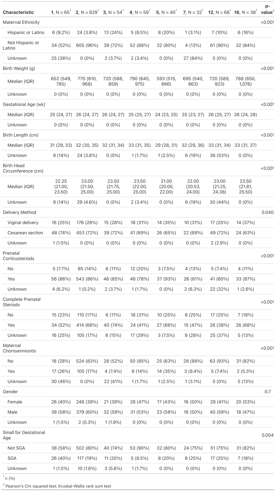
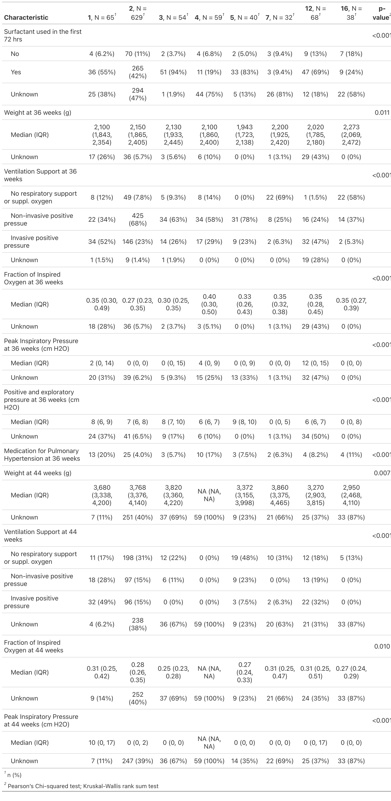
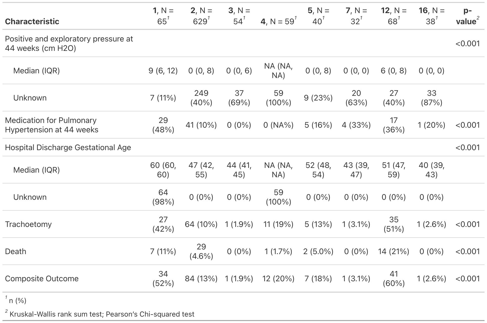

```{r setup, include=FALSE}
# remember to set them to FALSE
knitr::opts_chunk$set(echo = F)
knitr::opts_chunk$set(include = F)
knitr::opts_chunk$set(warning = F)
knitr::opts_chunk$set(message = F)
knitr::opts_chunk$set(eval = T)

knitr::opts_chunk$set(fig.height = 8)
knitr::opts_chunk$set(fig.width = 12)
knitr::opts_chunk$set(fig.align="center")

# Packages
library(boot)
library(tidyverse)
library(gtsummary)
library(kableExtra)
library(glmnet)
library(glmmLasso)
library(mice)
library(pROC)
```

```{r}
# read the results
coef.lasso <- readRDS("coef.lasso.RDS")
coef.lasso_wo_center <- readRDS("coef.lasso_wo_center.RDS")
coef.glmmLasso <- readRDS("coef.glmmLasso.RDS")
coef.summary <- readRDS("coef.summary.RDS")

coef.44.lasso <- readRDS("coef.44.lasso.RDS")
coef.44.lasso_wo_center <- readRDS("coef.44.lasso_wo_center.RDS")
coef.44.glmmLasso <- readRDS("coef.44.glmmLasso.RDS")
coef.44.summary <- readRDS("coef.44.summary.RDS")

df_summary_metric <- readRDS("df_summary_metric.RDS")
df_summary_metric.44 <- readRDS("df_summary_metric.44.RDS")
```

```{r}
# Read data and basic processing
df_child_original <- read.csv("project2.csv")
```


```{r}
df_child <- df_child_original

# delete duplicates
df_child <- df_child %>%
  group_by(record_id) %>%
  slice(1) %>% 
  ungroup()

# factorize
df_child$center <- factor(df_child$center)
df_child$mat_ethn <- factor(df_child$mat_ethn, 
                            labels = c("Hispanic or Latino",
                                       "Not Hispanic or Latino"))
df_child$del_method <- factor(df_child$del_method, 
                              labels = c("Viginal delivery", "Cesarean section"))
df_child$prenat_ster <- factor(df_child$prenat_ster)
df_child$com_prenat_ster <- factor(df_child$com_prenat_ster)
df_child$mat_chorio <- factor(df_child$mat_chorio)
df_child$gender <- factor(df_child$gender)
df_child$sga <- factor(df_child$sga)
df_child$any_surf <- factor(df_child$any_surf)
df_child$ventilation_support_level.36 <- 
  factor(df_child$ventilation_support_level.36,
         labels = c("No respiratory support or suppl. oxygen",
                    "Non-invasive positive pressue",
                    "Invasive positive pressure"))
df_child$ventilation_support_level_modified.44 <- 
  factor(df_child$ventilation_support_level_modified.44,
         labels = c("No respiratory support or suppl. oxygen",
                    "Non-invasive positive pressue",
                    "Invasive positive pressure"))
df_child$Death <- ifelse(df_child$Death == "Yes", 1, 0)

# fill in the ones for centers - all in center 1
# this missing seems no reasons
df_child$center[is.na(df_child$center)] <- 1

# Create the new outcome based on Trach and Death
df_child$outcome <- ifelse(df_child$Trach == 1 | df_child$Death == 1,
                           1, 0)

# the subset we will focus on
df_child_sub <- df_child %>%
  filter(!center %in% c(20, 21)) %>%
  dplyr::select(-c(weight_today.44:med_ph.44)) %>%
  mutate(center = factor(center)) %>% 
  filter(!is.na(outcome)) %>% 
  filter(is.na(hosp_dc_ga) | (hosp_dc_ga < 300 & hosp_dc_ga > 30)) %>% 
  dplyr::select(-mat_race)

df_child_full <- df_child %>%
  filter(!center %in% c(20, 21)) %>% 
  mutate(center = factor(center))

# remove the ones with missing outcomes, two outliers in sga
# 2 more than 300 weeks; 2 discharge wk < 30 but they have measurement at 36 wk
df_child_full <- df_child_full %>% 
  filter(!is.na(outcome)) %>% 
  filter(is.na(hosp_dc_ga) | (hosp_dc_ga < 300 & hosp_dc_ga > 30))

# Drop race - since not sure about its correspondence
df_child_full <- df_child_full %>% 
  dplyr::select(-mat_race)
```


```{r, eval = F}
# Generate the partial table - save it
df_child_full %>%
  dplyr::select(-record_id) %>% 
  dplyr::mutate_if(is.factor, function(x)
    forcats::fct_explicit_na(x, na_level = "Unknown")) %>% 
  dplyr::select(center:sga) %>% 
  tbl_summary(by = "center",
              
              type = all_continuous() ~ "continuous2",
              label = c(mat_ethn ~ "Maternal Ethnicity",
                        bw ~ "Birth Weight (g)",
                        ga ~ "Gestational Age (wk)",
                        blength ~ "Birth Length (cm)",
                        birth_hc ~ "Birth Head Circumference (cm)",
                        del_method ~ "Delivery Method",
                        prenat_ster ~ "Prenatal Corticosteriods",
                        com_prenat_ster ~ "Complete Prenatal Steriods",
                        mat_chorio ~ "Maternal Chorioamniontis",
                        gender ~ "Gender",
                        sga ~ "Small for Gestational Age"),
              missing = "no",
              statistic = all_continuous() ~ c("{median} ({p25}, {p75})",
                                               "{N_miss} ({p_miss}%)")) %>% 
  add_p(all_categorical() ~ "chisq.test") %>% 
    modify_table_body(
    dplyr::mutate,
    label = ifelse(label == "N missing (% missing)",
                   "Unknown",
                   label)) %>% 
    as_gt() %>% gt::gtsave("summary_table_p1.png")
```

```{r, eval = F}
# Generate the partial table 2 - save it
df_child_full %>%
  dplyr::select(-record_id) %>% 
  dplyr::mutate_if(is.factor, function(x)
    forcats::fct_explicit_na(x, na_level = "Unknown")) %>% 
  dplyr::select(-c(mat_ethn:sga, peep_cm_h2o_modified.44:outcome)) %>% 
  tbl_summary(by = "center",
              type = all_continuous() ~ "continuous2",
              label = c(
                        any_surf ~ "Surfactant used in the first 72 hrs",
                        weight_today.36 ~ "Weight at 36 weeks (g)",
                        ventilation_support_level.36 ~ "Ventilation Support at 36 weeks",
                        inspired_oxygen.36 ~ "Fraction of Inspired Oxygen at 36 weeks",
                        p_delta.36 ~ "Peak Inspiratory Pressure at 36 weeks (cm H2O)",
                        peep_cm_h2o_modified.36 ~ "Positive and exploratory pressure at 36 weeks (cm H2O)",
                        med_ph.36 ~ "Medication for Pulmonary Hypertension at 36 weeks",
                        weight_today.44 ~ "Weight at 44 weeks (g)",
                        
                        ventilation_support_level_modified.44 ~ "Ventilation Support at 44 weeks",
                        inspired_oxygen.44 ~ "Fraction of Inspired Oxygen at 44 weeks",
                        p_delta.44 ~ "Peak Inspiratory Pressure at 44 weeks (cm H2O)"
                        ),
              missing = "no",
              statistic = all_continuous() ~ c("{median} ({p25}, {p75})",
                                               "{N_miss} ({p_miss}%)")) %>% 
  add_p(all_categorical() ~ "chisq.test") %>% 
    modify_table_body(
    dplyr::mutate,
    label = ifelse(label == "N missing (% missing)",
                   "Unknown",
                   label)) %>% 
    as_gt() %>% gt::gtsave("summary_table_p2.png")
```

```{r, eval = F}
# Generate the partial table 3 - save it
df_child_full %>%
  dplyr::select(-record_id) %>% 
  dplyr::mutate_if(is.factor, function(x)
    forcats::fct_explicit_na(x, na_level = "Unknown")) %>% 
  dplyr::select(-c(mat_ethn:p_delta.44)) %>% 
  tbl_summary(by = "center",
              type = all_continuous() ~ "continuous2",
              label = c(peep_cm_h2o_modified.44 ~ "Positive and exploratory pressure at 44 weeks (cm H2O)",
                        med_ph.44 ~ "Medication for Pulmonary Hypertension at 44 weeks",
                        hosp_dc_ga ~ "Hospital Discharge Gestational Age",
                        Trach ~ "Trachoetomy",
                        outcome ~ "Composite Outcome"),
              missing = "no",
              statistic = all_continuous() ~ c("{median} ({p25}, {p75})",
                                               "{N_miss} ({p_miss}%)")) %>% 
  add_p(all_categorical() ~ "chisq.test") %>% 
    modify_table_body(
    dplyr::mutate,
    label = ifelse(label == "N missing (% missing)",
                   "Unknown",
                   label)) %>% 
    as_gt() %>% gt::gtsave("summary_table_p3.png")
```


```{r, eval = F}
# Generate the full summary table - save it
df_child_full %>%
  dplyr::select(-record_id) %>% 
  dplyr::mutate_if(is.factor, function(x)
    forcats::fct_explicit_na(x, na_level = "Unknown")) %>% 
  tbl_summary(by = "center",
              type = all_continuous() ~ "continuous2",
              label = c(mat_ethn ~ "Maternal Ethnicity",
                        bw ~ "Birth Weight (g)",
                        ga ~ "Gestational Age (wk)",
                        blength ~ "Birth Length (cm)",
                        birth_hc ~ "Birth Head Circumference (cm)",
                        del_method ~ "Delivery Method",
                        prenat_ster ~ "Prenatal Corticosteriods",
                        com_prenat_ster ~ "Complete Prenatal Steriods",
                        mat_chorio ~ "Maternal Chorioamniontis",
                        gender ~ "Gender",
                        sga ~ "Small for Gestational Age",
                        any_surf ~ "Surfactant used in the first 72 hrs",
                        weight_today.36 ~ "Weight at 36 weeks (g)",
                        ventilation_support_level.36 ~ "Ventilation Support at 36 weeks",
                        inspired_oxygen.36 ~ "Fraction of Inspired Oxygen at 36 weeks",
                        p_delta.36 ~ "Peak Inspiratory Pressure at 36 weeks (cm H2O)",
                        peep_cm_h2o_modified.36 ~ "Positive and exploratory pressure at 36 weeks (cm H2O)",
                        med_ph.36 ~ "Medication for Pulmonary Hypertension at 36 weeks",
                        weight_today.44 ~ "Weight at 44 weeks (g)",
                        
                        ventilation_support_level_modified.44 ~ "Ventilation Support at 44 weeks",
                        inspired_oxygen.44 ~ "Fraction of Inspired Oxygen at 44 weeks",
                        p_delta.44 ~ "Peak Inspiratory Pressure at 44 weeks (cm H2O)",
                        peep_cm_h2o_modified.44 ~ "Positive and exploratory pressure at 44 weeks (cm H2O)",
                        
                        hosp_dc_ga ~ "Hospital Discharge Gestational Age",
                        Trach ~ "Trachoetomy",
                        outcome ~ "Composite Outcome"),
              missing = "no",
              statistic = all_continuous() ~ c("{median} ({p25}, {p75})",
                                               "{N_miss} ({p_miss}%)")) %>% 
  add_p(all_categorical() ~ "chisq.test") %>% 
    modify_table_body(
    dplyr::mutate,
    label = ifelse(label == "N missing (% missing)",
                   "Unknown",
                   label)) %>% 
  as_gt() %>% gt::gtsave("summary_table.png")
  
```

## Introduction

Bronchopulmonary dysplasia (BPD) is a chronic lung condition primarily affecting premature infants, marked by an imbalance between lung injury and repair during lung development [1, 2]. As the most common respiratory morbidity in preterm infants, BPD impacts nearly 10,000 – 15000 neonates annually in the United States. Despite significant advancements in managing extremely low birth weight (ELBW) infants, the incidence of BPD over the past two decades hasn’t decreased. The pathogenesis of BPD is complex and varied by genetic and epigenetic factors for different individuals. Gestational age and birth weight are two of the strongest predictors: the risk of BPD is directly proportional to the degree of prematurity and low birth weight. For instance, infants born at 23 weeks have a significantly higher incidence and severity of BPD compared to those born at 28 weeks. Chorioamnionitis is also a frequent cause of preterm births, which likely results in serious complications in mother and babies but also BPD [@Jain]. 

On the other hand, there are life-saving interventions including oxygen supplementation and mechanical ventilation, but they can potentially disrupt lung development and cause damage for neonates, and thus mechanical ventilation should be avoid when possible [@review]. To prevent this damage but also help infants acquire necessary oxygen, tracheostomy can be planted in patients with severe BPD when discharged from hospital [@2550]. Although tracheostomy is still hooked with a ventilator, it has benefits in infant lung and neural development including improving ventilator synchrony, weaning sedation requirements, etc. However, tracheostomy is associated with an increased risk of death, meaning whether using tracheostomy should be carefully considered.

Unal et al. conducted case studies with 9 neonates admitted to neonatal intensive care units (NICU), and they showed tracheotomy, if carried out correctly, makes infant nursing easier with low complication [@Unal]. Adaikalam et al. have developed a tracheostomy prediction model for neonatal BPD via lung and airway MRI, while MRI might not be available for neonates at many hospitals. Murthy et al. developed a prediction model to estimate the risk of death or tracheostomy in infants with severe BOD [@Murthy]. However this study didn't different centers nor measurements at different time points. At present, no prediction models for tracheostomy based on easily accessible clinical diagnosis have considered the homogeneity of centers and the measurements over time. This study aims to develop a tracheostomy/death prediction model in neonatal BPD with easily accessible measurements, and it also address timing consideration of whether the infant needs more care.


## Methods

### Study setting and population

Study participants were drawn from the BPD Collaborative Registry, a multi-center consortium of interdisciplinary BPD programs located in the United States and Sweden formed to address gaps in evidence and promote research to enhance the care of children with severe forms of BPD. The registry includes infants whose gestational age is less than 32 weeks and who have severe bronchopulmonary dysplasia (sBPD) (defined by 2001 NHLBI criteria; specifically, FiO2 $\geq$ 0.3 or positive pressure ventilation (invasive or non-invasive) at 36-weeks PMA). In the registry, standard demographic and clinical data are collected at four time points: birth, 36 weeks PMA, 44 weeks PMA and discharge [@2550].

Between January 1 and July 19, 2021, a total of 999 records of neonates with BPD were in the registry. At the time of analysis, 10 BPD Collaborative centers had contributed data meeting study inclusion criteria. Of these, 3 were excluded due to duplicate records, 5 were excluded because the their center size (n = 4; n = 1) were too small in this study. The hospital discharge gestational age for these two centers were not lower compared to other centers overall, meaning the neonates in these centers didn't seem to be transferred to other centers. We removed these records because it may cause overfitting  and problems in train-test split. Although these observations could be used in models that don't consider center, the resulting prediction results and accuracy could correspond to different sub-populations.

In addition, 2 records were excluded due to missing death indicators, and 4 were excluded due to outliers in gestational age at discharge. 985 observations were left for the following analysis. To consider timing of tracheostomy, we considered two different scenarios: predicting the status of infants given the measurements at 36 weeks (n = 985); predicting the status given the measurements at both 36 and 44 weeks. For the first scenario, we used all records without looking at the 44 weeks measurements. For the second scenario, we removed the observations discharged before 44 weeks. 

Maternal race was excluded because its values in the data didn't match the codebook. The remaining variables have demographic information, supporting factors like steroids, measurements of infants at birth and at 36 weeks, tracheostomy usage, and death. We combined tracheostomy and death into a composite outcome - whether infants had tracheostomy or died - because the number of cases for each is too low. This means that our model aim to predict the BPD status of the infants about whether they would be likely to need tracheostomy at discharge or have risk to die. However, this model won't provided a relative risk between tracheostomy and death.

### Model derivation

To perform variable selection and utilize a mixed effects model for different centers, Lasso regression models was chosen as a public available R package `glmmLasso` can construct mixed effects modes with L1 regularization [@glmmLasso]. For each timing scenario, two separate models were developed with center as a factor and without center. This modeling part was performed using `glmnet` package in R [@Friedman]. A multilevel lasso regression model was developed by treating the data clustered by center, and a random effect was fit for center while fixed effects for the rest. This modeling part was performed using `glmmLasso` package in R. One-hot encoding was applied to the train data, while center indicator was excluded from normalization for the multilevel lasso.

### Imputation and cross-validation

Multiple imputation was applied following the guidance by He [@He]. Specifically, we replaced the missing values for surfactant usage indicator because its missing proportion is too high. Also, we used the original outcome variables tracheostomy and death in imputation formula to retain the association between predictors and the outcome rather than the composite outcome. The data set was split into train set (n = 660) and validation set (n = 325) by 2:1 ratio sampled by center. Multiple imputation with 5 imputed sets was done first in the train set, and the same imputation model was fit on the test set separately. This prevents the imputed values in the train set borrow information from test set and vice versa. All imputation was done by `mice` package in R [@mice].

5-fold cross-validation was performed to estimate the optimal hyperparameter $\lambda$ for all three models. The fold index was generated by center and remained the same. The cross-validation for two lasso regression models was done by function `cv.glmnet`. For the multilevel lasso regression, a grid search method was applied: for each validation set, AUC was calculated for 20 $\lambda$ ranging evenly from 0 to the max possible value where all coefficients shrink to 0. The optimal $\lambda$ was obtained by the highest average AUC. We then repeat this grid search within a smaller range bound the neighboring values of the optimal $\lambda$. 

### Model performance

Models were examined on the validation set based on their sensitivity, specificity, AUC, and F-score. The optimal threshold for prediction was determined by Youden Index, where the maximum of sensitivity + specificity was achieved [@Youden]. The final validation set was composed of 5 imputed sets together, which is equivalent to evaluating the models on each imputed set and taking average.


```{r}
# Train Test split by center and outcome, ratio 2:1 
## any_surf - use "Missing" for NA values since its missing prop. is large
# Also remove record id
df_child_full <- df_child_full %>% 
  mutate(any_surf = case_when(any_surf == "Yes" ~ "Yes",
                              any_surf == "No" ~ "No",
                              .default = "Missing"))
set.seed(1)
test_index <- (df_child_full %>% 
                 filter(outcome == 0) %>% 
  group_by(center) %>% 
  sample_frac(0.33))$record_id

test_index <- c(test_index,
                (df_child_full %>% 
                 filter(outcome == 1) %>% 
  group_by(center) %>% 
  sample_frac(0.33))$record_id)

df_child_test <- df_child_full %>% 
  filter(record_id %in% test_index)

df_child_test_wo_id <- df_child_test %>% 
  select(-record_id)

df_child_train <- df_child_full %>% 
  filter(!record_id %in% test_index)

df_child_train_wo_id <- df_child_train %>% 
  select(-record_id)

# Do imputation separately
## First impute on train
## Remove composite outcome - since it will cause collinearity with trach/death
m <- 5

imp.train <- mice(df_child_train_wo_id %>% dplyr::select(-outcome),
                  m = m, print = FALSE, seed = 2550)
imp.test <- mice.mids(imp.train, newdata = df_child_test_wo_id  %>% dplyr::select(-outcome))
```

```{r}
# consider timing
# for 44 weeks - create a indicator whether be included or not
## discharged after 44 weeks
## if NA - like center 1, then no more than 2 measurmeents missing
df_child_44 <- df_child_full %>% 
  filter(hosp_dc_ga >= 44 | is.na(hosp_dc_ga)) %>% 
  mutate(n_miss = is.na(weight_today.44) + is.na(ventilation_support_level_modified.44) +
           is.na(inspired_oxygen.44) + is.na(p_delta.44) + is.na(peep_cm_h2o_modified.44)+
           is.na(med_ph.44)) %>% 
  filter(hosp_dc_ga >= 44 | n_miss <= 2)
index_44 <- match(df_child_44$record_id, df_child_full$record_id)

## train-test split
set.seed(1)
test_index_44 <- (df_child_44 %>% 
                 filter(outcome == 0) %>% 
  group_by(center) %>% 
  sample_frac(0.33))$record_id

test_index_44 <- c(test_index_44,
                (df_child_full %>% 
                 filter(outcome == 1) %>% 
  group_by(center) %>% 
  sample_frac(0.33))$record_id)

test_index_44 <- match(test_index_44, df_child_full$record_id)
train_index_44 <- index_44[!(index_44 %in% test_index_44)]
```


```{r}
# Cross validation - needed for lasso
## Define the fold index - keep the same
set.seed(2550)
k <- 5 # 5-fold CV

# sample by group
folds <- (df_child_train %>% 
  group_by(center) %>% 
  mutate(fold_index = sample(1:k, n(), replace = TRUE)))$fold_index
```


```{r, eval = F}
# Loop through each imputed set
coef.lasso <- c()
coef.lasso_wo_center <- c()
coef.glmmLasso <- c()
for (i in 1:m){
  imp.data <- complete(imp.train, i) %>%
    dplyr::select(center:med_ph.36) %>% 
    mutate(outcome = df_child_train$outcome)
  x.ord <- model.matrix(outcome ~. , data = imp.data)[,-1]
  x.ord <- scale(x.ord,center=TRUE,scale=TRUE)
  x.ord_wo_center <- model.matrix(outcome ~. , 
                                  data = imp.data %>% dplyr::select(-center))[,-1]
  x.ord_wo_center <- scale(x.ord_wo_center, center=TRUE,scale=TRUE)
  y.ord <- imp.data$outcome

  
  # Lasso
  lasso_mod_cv <- cv.glmnet(x.ord, y.ord, nfolds = k, foldid = folds, 
                       alpha = 1, family = "binomial", standardize = FALSE) 
  # fit on the full data
  lasso_mod <- glmnet(x.ord, y.ord,
                      alpha=1, family = "binomial",
                      lambda = lasso_mod_cv$lambda.min, standardize = FALSE)
  
  # Lasso without center
  lasso_mod_cv_wo_center <- cv.glmnet(x.ord_wo_center, y.ord, nfolds = k, foldid = folds, 
                       alpha = 1, family = "binomial", standardize = FALSE) 
  # fit on the full data
  lasso_mod_wo_center <- glmnet(x.ord_wo_center, y.ord,
                      alpha=1, family = "binomial",
                      lambda = lasso_mod_cv_wo_center$lambda.min, standardize = FALSE)
  
  # Multilevel Lasso
  ## Set the lambda grid - first calculate the maximum
  ## Make the combined set for glmmLasso function
  xy.ord <- cbind(imp.data$center, x.ord_wo_center)
  xy.ord <- cbind(xy.ord, y.ord)
  colnames(xy.ord)[1] <- "center"
  colnames(xy.ord)[ncol(xy.ord)] <- "outcome"
  xy.ord <- data.frame(xy.ord)
  xy.ord$center <- factor(imp.data$center)
  
  lambda_max <- max(abs(colSums(x.ord * ifelse(y.ord == 1, mean(y.ord), mean(y.ord)-1))))
  
  # write out the formula
  glmmLasso_formula <- formula(
    paste0("outcome ~ ", paste0(
      colnames(xy.ord)[!colnames(xy.ord) %in% c("center", "outcome")], 
      collapse = " + ")))
  
  lambda_set <- seq(0, lambda_max, length.out = 20)
  AUC_set <- matrix(nrow = 20, ncol = k)
  for (j in 1:20){
    # Go through 5-fold CV
    ## get AUC 5 times and average for each lambda
    for (fold in 1:k){
      # fit on 4 folds
      xy.ord.cv <- xy.ord[folds != fold, ]
      glmmLasso_mod <- glmmLasso(glmmLasso_formula, rnd = list(center=~1),
                   lambda=lambda_set[j], 
                   family = binomial(link = "logit"), data = xy.ord.cv)
      # test on the fold left
      glmmLasso_pred <- predict(glmmLasso_mod, 
                                newdata = xy.ord[folds == fold, ], 
                                type = "response")
      # AUC
      AUC_set[j, fold] <- as.numeric(auc(xy.ord[folds == fold, "outcome"],
                           glmmLasso_pred))
    }
  }
  # Average AUC
  AUC_avg <- rowMeans(AUC_set)
  # then repeat within a smaller range
  lambda_smaller_set <- seq(lambda_set[max(1, which.max(AUC_avg) - 1)], 
                            lambda_set[min(20, which.max(AUC_avg) + 1)], 
                            length.out = 50)
  AUC_set_final <- matrix(nrow = 50, ncol = k)
  for (j in 1:50){
    # Go through 5-fold CV
    ## get AUC 5 times and average for each lambda
    for (fold in 1:k){
      # fit on 4 folds
      xy.ord.cv <- xy.ord[folds != fold, ]
      glmmLasso_mod <- glmmLasso(glmmLasso_formula, rnd = list(center=~1),
                   lambda=lambda_smaller_set[j], 
                   family = binomial(link = "logit"), data = xy.ord.cv)
      # test on the fold left
      glmmLasso_pred <- predict(glmmLasso_mod, 
                                newdata = xy.ord[folds == fold, ], 
                                type = "response")
      # AUC
      AUC_set_final[j, fold] <- as.numeric(auc(xy.ord[folds == fold, "outcome"],
                           glmmLasso_pred))
    }
  }
  # Average AUC
  AUC_avg_final <- rowMeans(AUC_set_final)
  
  # run on full model for the optimal lambda estimated
  glmmLasso_mod <- glmmLasso(glmmLasso_formula, rnd = list(center=~1),
                   lambda=lambda_smaller_set[which.max(AUC_avg_final)], 
                   family = binomial(link = "logit"), data = xy.ord)
  
  # Get coefficients
  coef.lasso <- cbind(coef.lasso, coef(lasso_mod))
  coef.lasso_wo_center <- cbind(coef.lasso_wo_center, coef(lasso_mod_wo_center))
  coef.glmmLasso <- cbind(coef.glmmLasso,
                          c(glmmLasso_mod$coefficients[1], glmmLasso_mod$ranef,
                            glmmLasso_mod$coefficients[-1]))
}

# store the results
saveRDS(coef.lasso, "coef.lasso.RDS")
saveRDS(coef.lasso_wo_center, "coef.lasso_wo_center.RDS")
saveRDS(coef.glmmLasso, "coef.glmmLasso.RDS")
```

```{r, eval = F}
# Loop through each imputed set for 44 wk
coef.44.lasso <- c()
coef.44.lasso_wo_center <- c()
coef.44.glmmLasso <- c()
for (i in 1:m){
  imp.data <- complete(imp.train, i) %>%
    dplyr::select(-c(hosp_dc_ga:Death)) %>% 
    mutate(outcome = df_child_train$outcome)
  imp.data <- rbind(imp.data, 
                    complete(imp.test, i) %>%
                      dplyr::select(-c(hosp_dc_ga:Death)) %>% 
                      mutate(outcome = df_child_test$outcome))
  
  imp.data <- imp.data[c(train_index_44), ]
  x.ord <- model.matrix(outcome ~. , data = imp.data)[,-1]
  x.ord <- scale(x.ord,center=TRUE,scale=TRUE)
  x.ord_wo_center <- model.matrix(outcome ~. , 
                                  data = imp.data %>% dplyr::select(-center))[,-1]
  x.ord_wo_center <- scale(x.ord_wo_center, center=TRUE,scale=TRUE)
  y.ord <- imp.data$outcome
  
  set.seed(1)
  folds <- (imp.data %>% 
    group_by(center) %>% 
    mutate(fold_index = sample(1:k, n(), replace = TRUE)))$fold_index
  
  # Lasso
  lasso_mod_cv <- cv.glmnet(x.ord, y.ord, nfolds = k, foldid = folds, 
                       alpha = 1, family = "binomial", standardize = FALSE) 
  # fit on the full data
  lasso_mod <- glmnet(x.ord, y.ord,
                      alpha=1, family = "binomial",
                      lambda = lasso_mod_cv$lambda.min, standardize = FALSE)
  
  # Lasso without center
  lasso_mod_cv_wo_center <- cv.glmnet(x.ord_wo_center, y.ord, nfolds = k, foldid = folds, 
                       alpha = 1, family = "binomial", standardize = FALSE) 
  # fit on the full data
  lasso_mod_wo_center <- glmnet(x.ord_wo_center, y.ord,
                      alpha=1, family = "binomial",
                      lambda = lasso_mod_cv_wo_center$lambda.min, standardize = FALSE)
  
  # Multilevel Lasso
  ## Set the lambda grid - first calculate the maximum
  ## Make the combined set for glmmLasso function
  xy.ord <- cbind(imp.data$center, x.ord_wo_center)
  xy.ord <- cbind(xy.ord, y.ord)
  colnames(xy.ord)[1] <- "center"
  colnames(xy.ord)[ncol(xy.ord)] <- "outcome"
  xy.ord <- data.frame(xy.ord)
  xy.ord$center <- factor(imp.data$center)
  
  lambda_max <- max(abs(colSums(x.ord * ifelse(y.ord == 1, mean(y.ord), mean(y.ord)-1))))
  
  # write out the formula
  glmmLasso_formula <- formula(
    paste0("outcome ~ ", paste0(
      colnames(xy.ord)[!colnames(xy.ord) %in% c("center", "outcome")], 
      collapse = " + ")))
  
  lambda_set <- seq(0, lambda_max, length.out = 20)
  AUC_set <- matrix(nrow = 20, ncol = k)
  for (j in 1:20){
    # Go through 5-fold CV
    ## get AUC 5 times and average for each lambda
    for (fold in 1:k){
      # fit on 4 folds
      xy.ord.cv <- xy.ord[folds != fold, ]
      glmmLasso_mod <- glmmLasso(glmmLasso_formula, rnd = list(center=~1),
                   lambda=lambda_set[j], 
                   family = binomial(link = "logit"), data = xy.ord.cv)
      # test on the fold left
      glmmLasso_pred <- predict(glmmLasso_mod, 
                                newdata = xy.ord[folds == fold, ], 
                                type = "response")
      # AUC
      AUC_set[j, fold] <- as.numeric(auc(xy.ord[folds == fold, "outcome"],
                           glmmLasso_pred))
    }
  }
  # Average AUC
  AUC_avg <- rowMeans(AUC_set)
  # then repeat within a smaller range
  lambda_smaller_set <- seq(lambda_set[max(1, which.max(AUC_avg) - 1)], 
                            lambda_set[min(20, which.max(AUC_avg) + 1)], 
                            length.out = 50)
  AUC_set_final <- matrix(nrow = 50, ncol = k)
  for (j in 1:50){
    # Go through 5-fold CV
    ## get AUC 5 times and average for each lambda
    for (fold in 1:k){
      # fit on 4 folds
      xy.ord.cv <- xy.ord[folds != fold, ]
      glmmLasso_mod <- glmmLasso(glmmLasso_formula, rnd = list(center=~1),
                   lambda=lambda_smaller_set[j], 
                   family = binomial(link = "logit"), data = xy.ord.cv)
      # test on the fold left
      glmmLasso_pred <- predict(glmmLasso_mod, 
                                newdata = xy.ord[folds == fold, ], 
                                type = "response")
      # AUC
      AUC_set_final[j, fold] <- as.numeric(auc(xy.ord[folds == fold, "outcome"],
                           glmmLasso_pred))
    }
  }
  # Average AUC
  AUC_avg_final <- rowMeans(AUC_set_final)
  
  # run on full model for the optimal lambda estimated
  glmmLasso_mod <- glmmLasso(glmmLasso_formula, rnd = list(center=~1),
                   lambda=lambda_smaller_set[which.max(AUC_avg_final)], 
                   family = binomial(link = "logit"), data = xy.ord)
  
  # Get coefficients
  coef.44.lasso <- cbind(coef.44.lasso, coef(lasso_mod))
  coef.44.lasso_wo_center <- cbind(coef.44.lasso_wo_center, coef(lasso_mod_wo_center))
  coef.44.glmmLasso <- cbind(coef.44.glmmLasso,
                          c(glmmLasso_mod$coefficients[1], glmmLasso_mod$ranef,
                            glmmLasso_mod$coefficients[-1]))
}

# store the results
saveRDS(coef.44.lasso, "coef.44.lasso.RDS")
saveRDS(coef.44.lasso_wo_center, "coef.44.lasso_wo_center.RDS")
saveRDS(coef.44.glmmLasso, "coef.44.glmmLasso.RDS")
```


```{r, eval = F}
# take average across five imputed sets
coef.lasso.avg <- rowMeans(as.matrix(coef.lasso))
coef.lasso_wo_center.avg <- rowMeans(as.matrix(coef.lasso_wo_center))
coef.glmmLasso.avg <- rowMeans(as.matrix(coef.glmmLasso))

# Adjust for center - for formatting
## Provide intercept for each center
coef.lasso.avg.adjust <- coef.lasso.avg
coef.lasso.avg.adjust[2:8] <- coef.lasso.avg.adjust[2:8] + coef.lasso.avg.adjust[1]

coef.lasso_wo_center.avg.adjust <- c(rep(coef.lasso_wo_center.avg[1], 8), 
                                     coef.lasso_wo_center.avg[-1])
coef.glmmLasso.avg.adjust <- c(coef.glmmLasso.avg[2:9] + coef.glmmLasso.avg[1],
                               coef.glmmLasso.avg[10:29])
# make summary dataframe and table
coef.summary <- data.frame(
  matrix(c(coef.lasso.avg.adjust, 
           coef.lasso_wo_center.avg.adjust,
           coef.glmmLasso.avg.adjust), ncol = 3)
)
coef.summary <- round(coef.summary, 3)
row.names(coef.summary) <- c("Center 1", "Center 2", "Center 3", "Center 4",
                             "Center 5", "Center 7", "Center 12", "Center 16",
                             "Not Hispanic or Latino", "Birth Weight", "Gestational Age",
                             "Birth length","Birth Head Circumference", 
                             "Delivery Method: Cesarean section",
                             "Prenatal Corticosteriods: Yes",
                             "Complete Prenatal Steriods: Yes",
                             "Maternal Chorioamniontis: Yes",
                             "Gender: Male", "SGA", "Surfactant: Yes",
                             "Surfactant: No", "Weight at 36 weeks",
                             "Ventilation Support at 36 weeks: Non-invasive",
                             "Ventilation Support at 36 weeks: Invasive",
                             "Inspired Oxygen at 36 weeks",
                             "Peak Inspiratory Pressure at 36 weeks",
                             "Positive and exploratory pressure at 36 weeks",
                             "Medication for Pulmonary Hypertension at 36 weeks"
                             )
colnames(coef.summary) <- c("Lasso (with center)", "Lasso (without center)",
                            "Multilevel Lasso")
saveRDS(coef.summary, "coef.summary.RDS")
```

```{r, eval = F}
# take average across five imputed sets
coef.44.lasso.avg <- rowMeans(as.matrix(coef.44.lasso))
coef.44.lasso_wo_center.avg <- rowMeans(as.matrix(coef.44.lasso_wo_center))
coef.44.glmmLasso.avg <- rowMeans(as.matrix(coef.44.glmmLasso))

# Adjust for center - for formatting
## Provide intercept for each center
coef.44.lasso.avg.adjust <- coef.44.lasso.avg
coef.44.lasso.avg.adjust[2:8] <- coef.44.lasso.avg.adjust[2:8] + coef.44.lasso.avg.adjust[1]

coef.44.lasso_wo_center.avg.adjust <- c(rep(coef.44.lasso_wo_center.avg[1], 8), 
                                     coef.44.lasso_wo_center.avg[-1])
coef.44.glmmLasso.avg.adjust <- c(coef.44.glmmLasso.avg[2:9] + coef.44.glmmLasso.avg[1],
                               coef.44.glmmLasso.avg[10:36])
# make summary dataframe and table
coef.44.summary <- data.frame(
  matrix(c(coef.44.lasso.avg.adjust, 
           coef.44.lasso_wo_center.avg.adjust,
           coef.44.glmmLasso.avg.adjust), ncol = 3)
)
coef.44.summary <- round(coef.44.summary, 3)
row.names(coef.44.summary) <- c("Center 1", "Center 2", "Center 3", "Center 4",
                             "Center 5", "Center 7", "Center 12", "Center 16",
                             "Not Hispanic or Latino", "Birth Weight", "Gestational Age",
                             "Birth length","Birth Head Circumference", 
                             "Delivery Method: Cesarean section",
                             "Prenatal Corticosteriods: Yes",
                             "Complete Prenatal Steriods: Yes",
                             "Maternal Chorioamniontis: Yes",
                             "Gender: Male", "SGA", "Surfactant: Yes",
                             "Surfactant: No", "Weight at 36 weeks",
                             "Ventilation Support at 36 weeks: Non-invasive",
                             "Ventilation Support at 36 weeks: Invasive",
                             "Inspired Oxygen at 36 weeks",
                             "Peak Inspiratory Pressure at 36 weeks",
                             "Positive and exploratory pressure at 36 weeks",
                             "Medication for Pulmonary Hypertension at 36 weeks",
                             "Weight at 44 weeks",
                             "Ventilation Support at 44 weeks: Non-invasive",
                             "Ventilation Support at 44 weeks: Invasive",
                             "Inspired Oxygen at 44 weeks",
                             "Peak Inspiratory Pressure at 44 weeks",
                             "Positive and exploratory pressure at 44 weeks",
                             "Medication for Pulmonary Hypertension at 44 weeks"
                             )
colnames(coef.44.summary) <- c("Lasso (with center)", "Lasso (without center)",
                            "Multilevel Lasso")
saveRDS(coef.44.summary, "coef.44.summary.RDS")
```

## Results

### Study population characteristics

Figure 1 and 2 summarize the above characteristics stratified by center, and centers differ from each other significantly regarding the baseline and the outcome. Center 2 has the highest number of infants admitted (n = 630), while center like 16 only has 38. Infants in center 1 have a low median gestational age, short birth length, and birth weight, which is associated with the high proportion in composite outcome; however, infants in center 5 have worse baseline characteristics but has a much lower proportion in composite outcome. There is no obvious trend agreed across centers regarding the association between characteristics and the outcome.

Figure 3 shows the positive correlation between birth weight and gestational age, and it seems to have a regression line can determine whether the infant is small for gestational age (SGA) or not. This could imply multi-collinearity in the data since many clinical decisions and measurements are associated. In addition, most infants with composite outcome are not SGA, meaning they should have a better baseline health level but the results are counterintuitive.


```{r, include=TRUE, out.width="100%", fig.cap="Summary table of the characteristics stratified by center."}

```

```{r, include=TRUE, out.width="100%", fig.cap="(Continued) Summary table of the characteristics stratified by center."}

```

```{r, include=TRUE, out.width="75%", out.height="70%",fig.cap="(Continued) Summary table of the characteristics stratified by center."}

```

```{r, include = TRUE, out.height="85%", out.width="85%", fig.cap="Association between birth weight and gestational age at birth. Points are colored by SGA and scaled by the composite outcome."}
# Relationship between gestational age and birthweight
# also whether too small
ggplot(df_child_sub) +
  geom_jitter(aes(x = ga, y = bw, color = sga, 
                  size = factor(outcome, labels = c("No", "Yes"))),
              alpha = 0.5) +
  theme_minimal() +
  labs(x = "Gestational Age (wks)", y = "Birth Weight (g)", 
       color = "Small for Gestational Age (SGA)",
       size = "Tracheostomy/Death") +
  theme(legend.position = "bottom", legend.text = element_text(size = 14),
        legend.title = element_text(size = 16),
        axis.text = element_text(size = 14), 
        axis.title = element_text(size = 16))
```

### Model Performance

The model coefficients are obtained by averaging the coefficients from each imputed sets (Table 1). For consistency, we calculate the intercept for each center by adding the intercept and the individual center intercept. We see the overall trend among coefficients is consistent across three models as the sign and the relative magnitude are comparable. No variables are selected out by multilevel lasso regression, but they are close to 0 if these variables are selected out by the lasso regression with or without center. We see the predictors prenatal corticosteriods, invasive ventilation support at 36 weeks, inspired oxygen at 36 weeks, and gestational age have a high positive estimate across three models. The predictor non-invasive ventilation support at 36 weeks have a high negative estimate.

The most significant difference among these three models comes from the center intercepts due to the model derivation. The lasso regression without using center as a predictor has the same intercept. The one uses center and the multilevel lasso model have varying intercepts, but we see the difference tends to be larger in the multilevel one. For example, the maximum difference in intercepts is about 0.7 in the first lasso model, but the difference between center 2 and center 12 is more than 1 in multilevel lasso.


```{r, include = TRUE}
coef.summary.display <- 
  apply(coef.summary, c(1,2), function(x) {ifelse(abs(x) < 0.001, "", x)})
coef.summary.display %>% 
  kable(caption = "Coefficient estimates from 3 models at 36 weeks. The intercepts for Lasso models are
        calculated by combining the overall intercept and the individual center intercept,
        while the model without center doesn't have individual intercepts. Coefficients are
        rounded to three digits for display.",
  align = "c",
  booktabs = T) %>% 
  kable_styling(full_width=T, latex_options = c('HOLD_position'),
                font_size = 8)
```

```{r, include = TRUE}
coef.44.summary.display <- 
  apply(coef.44.summary, c(1,2), function(x) {ifelse(abs(x) < 0.001, "", x)})
coef.44.summary.display %>% 
  kable(caption = "Coefficient estimates from 3 models at 44 weeks.",
  align = "c",
  booktabs = T) %>% 
  kable_styling(full_width=T, latex_options = c('HOLD_position'),
                font_size = 8)
```

```{r}
# Performance on the test set

# get 5 imputed sets and combine
## equivalent to evaluation on each set and taking average
set.seed(1)
complete.test <- c()
for (i in 1:5){
  complete.test <- rbind(complete.test, 
                         complete(imp.test, i))
}
# add outcome back
complete.test <- complete.test %>% 
  dplyr::select(center:med_ph.36)
complete.test$outcome <- rep(df_child_test$outcome, 5)

# add center 1 
x.test <- model.matrix(outcome ~. , data = complete.test)[,-1]
x.test <- cbind("center1" = ifelse(complete.test$center == 1, 1, 0),
                x.test)
x.test.scale <- scale(x.test)

# predicted values - and transform into prob
pred.lasso <- inv.logit(x.test.scale[, 9:28] %*% coef.summary[9:28, 1] +
                              x.test[, 1:8] %*% coef.summary[1:8, 1])

pred.lasso_wo_center <- inv.logit(x.test.scale[, 9:28] %*% coef.summary[9:28, 2] +
                              x.test[, 1:8] %*% coef.summary[1:8, 2])

pred.glmmLasso <- inv.logit(x.test.scale[, 9:28] %*% coef.summary[9:28, 3] +
                              x.test[, 1:8] %*% coef.summary[1:8, 3])
# matrix(c(pred.lasso, pred.lasso_wo_center, pred.glmmLasso), ncol = 3)
```


```{r}
# Performance on the test set for 44 weeks

# get 5 imputed sets and combine
## equivalent to evaluation on each set and taking average
set.seed(1)
complete.44.test <- c()
for (i in 1:5){
  complete.44.test_i <- complete(imp.train, i) %>%
    dplyr::select(-c(Trach, Death)) %>% 
    mutate(outcome = df_child_train$outcome)
  complete.44.test_i <- rbind(complete.44.test_i, 
                      complete(imp.test, i) %>%
                      dplyr::select(-c(Trach, Death)) %>% 
                      mutate(outcome = df_child_test$outcome))
  complete.44.test <- rbind(complete.44.test,
                            complete.44.test_i[test_index_44,])
}

# add center 1 
x.44.test <- model.matrix(outcome ~. , data = complete.44.test)[,-1]
x.44.test <- cbind("center1" = ifelse(complete.44.test$center == 1, 1, 0),
                x.44.test)
x.44.test.scale <- scale(x.44.test)

# predicted values - and transform into prob
pred.44.lasso <- inv.logit(x.44.test.scale[, 9:35] %*% coef.44.summary[9:35, 1] +
                              x.44.test[, 1:8] %*% coef.44.summary[1:8, 1])

pred.44.lasso_wo_center <- inv.logit(x.44.test.scale[, 9:35] %*% coef.44.summary[9:35, 2] +
                              x.44.test[, 1:8] %*% coef.44.summary[1:8, 2])

pred.44.glmmLasso <- inv.logit(x.44.test.scale[, 9:35] %*% coef.44.summary[9:35, 3] +
                              x.44.test[, 1:8] %*% coef.44.summary[1:8, 3])
# matrix(c(pred.lasso, pred.lasso_wo_center, pred.glmmLasso), ncol = 3)
```

```{r}
# Calculate performance metrics

## ROC object
roc.lasso <- roc(complete.test$outcome, pred.lasso)
roc.lasso_wo_center <- roc(complete.test$outcome, pred.lasso_wo_center)
roc.glmmLasso <- roc(complete.test$outcome, pred.glmmLasso)

# Find optimal threshold
## Using Youden's J statistics
optimal_index.lasso <- which.max(roc.lasso$sensitivities + roc.lasso$specificities - 1)
optimal_index.lasso_wo_center <- which.max(roc.lasso_wo_center$sensitivities +
                                             roc.lasso_wo_center$specificities - 1)
optimal_index.glmmLasso <- which.max(roc.glmmLasso$sensitivities + 
                                       roc.glmmLasso$specificities - 1)

optimal_threshold.lasso <- 
  roc.lasso$thresholds[optimal_index.lasso]
optimal_threshold.lasso_wo_center <- 
  roc.lasso_wo_center$thresholds[optimal_index.lasso_wo_center]
optimal_threshold.glmmLasso <- 
  roc.glmmLasso$thresholds[optimal_index.glmmLasso]
```

```{r}
# Calculate performance metrics for 44 wks

## ROC object
roc.44.lasso <- roc(complete.44.test$outcome, pred.44.lasso)
roc.44.lasso_wo_center <- roc(complete.44.test$outcome, pred.44.lasso_wo_center)
roc.44.glmmLasso <- roc(complete.44.test$outcome, pred.44.glmmLasso)

# Find optimal threshold
## Using Youden's J statistics
optimal_index.44.lasso <- which.max(roc.44.lasso$sensitivities + roc.44.lasso$specificities - 1)
optimal_index.44.lasso_wo_center <- which.max(roc.44.lasso_wo_center$sensitivities +
                                             roc.44.lasso_wo_center$specificities - 1)
optimal_index.44.glmmLasso <- which.max(roc.44.glmmLasso$sensitivities + 
                                       roc.44.glmmLasso$specificities - 1)

optimal_threshold.44.lasso <- 
  roc.44.lasso$thresholds[optimal_index.44.lasso]
optimal_threshold.44.lasso_wo_center <- 
  roc.44.lasso_wo_center$thresholds[optimal_index.44.lasso_wo_center]
optimal_threshold.44.glmmLasso <- 
  roc.44.glmmLasso$thresholds[optimal_index.44.glmmLasso]
```


```{r}
F_score <- function(actual, pred, threshold = 0.5){
  #' Calculate the F-score given the actual outcome and predicted values
  #' @param actual the actual outcome values
  #' @param pred the predicted probabilities from the model
  #' @param threshold the threshold to determine the predicted outcomes based on probabilities
  #' @return the F-score calculated
  
  pred.outcome <- ifelse(pred > threshold, 1, 0)
  
  # calculate precision and recall
  TP = sum(actual == 1 & pred.outcome == 1)
  FP = sum(actual == 0 & pred.outcome == 1)
  FN = sum(actual == 1 & pred.outcome == 0)
  
  precision = TP/(TP+FP)
  recall = TP/(TP+FN)
  
  # calculate F-score
  return(1/((1/recall + 1/precision)/2))
}
```

```{r, eval = F}
# summary table for optimal metrics
df_summary_metric <- data.frame(
  thresholds = c(optimal_threshold.lasso,
                 optimal_threshold.lasso_wo_center,
                 optimal_threshold.glmmLasso),
  sensitivity = c(roc.lasso$sensitivities[optimal_index.lasso],
                  roc.lasso_wo_center$sensitivities[optimal_index.lasso_wo_center],
                  roc.glmmLasso$sensitivities[optimal_index.glmmLasso]),
  specificity = c(roc.lasso$specificities[optimal_index.lasso],
                  roc.lasso_wo_center$specificities[optimal_index.lasso_wo_center],
                  roc.glmmLasso$specificities[optimal_index.glmmLasso]),
  AUC = c(roc.lasso$auc, roc.lasso_wo_center$auc, roc.glmmLasso$auc),
  F_score = c(F_score(complete.test$outcome, pred.lasso, optimal_threshold.lasso),
              F_score(complete.test$outcome, pred.lasso_wo_center, 
                      optimal_threshold.lasso_wo_center),
              F_score(complete.test$outcome, pred.glmmLasso, 
                      optimal_threshold.glmmLasso))
) %>% t()
rownames(df_summary_metric) <- c("Threshold", "Sensitivity", "Specificity",
                                 "AUC", "F-score")

# summary table for optimal metrics for 44 wks
df_summary_metric.44 <- data.frame(
  thresholds = c(optimal_threshold.44.lasso,
                 optimal_threshold.44.lasso_wo_center,
                 optimal_threshold.44.glmmLasso),
  sensitivity = c(roc.44.lasso$sensitivities[optimal_index.44.lasso],
                  roc.44.lasso_wo_center$sensitivities[optimal_index.44.lasso_wo_center],
                  roc.44.glmmLasso$sensitivities[optimal_index.44.glmmLasso]),
  specificity = c(roc.44.lasso$specificities[optimal_index.44.lasso],
                  roc.44.lasso_wo_center$specificities[optimal_index.44.lasso_wo_center],
                  roc.44.glmmLasso$specificities[optimal_index.44.glmmLasso]),
  AUC = c(roc.44.lasso$auc, roc.44.lasso_wo_center$auc, roc.44.glmmLasso$auc),
  F_score = c(F_score(complete.44.test$outcome, pred.44.lasso, optimal_threshold.44.lasso),
              F_score(complete.44.test$outcome, pred.44.lasso_wo_center, 
                      optimal_threshold.44.lasso_wo_center),
              F_score(complete.44.test$outcome, pred.44.glmmLasso, 
                      optimal_threshold.44.glmmLasso))
) %>% t()
rownames(df_summary_metric.44) <- c("Threshold", "Sensitivity", "Specificity",
                                 "AUC", "F-score")

saveRDS(df_summary_metric, "df_summary_metric.RDS")
saveRDS(df_summary_metric.44, "df_summary_metric.44.RDS")
```

On the validation data, we see the multilevel lasso model achives the highest AUC (0.910), which is slightly higher than the lasso model with center (0.904) and much higher than the one without center (0.884) (Table 2). It also has a highest F-score among three models. At thier optimal thresholds, we see multilevel lasso has the highest specificity, and the lasso without center has the highest sensitivity, but this performance difference can be due to the difference in threshold.

In ROC curves, we see multilevel Lasso has the best performance at high specificity compared to the other two, and it becomes comparable with the lasso model with center at high sensitivity. The lasso model without center tends to be the worst (Figure 3).


```{r, include=TRUE}
df_summary_metric %>% 
  round(3) %>% 
  kable(caption = "Model performance on the evaluation data set at 36 weeks.
  The values are obtained at the optimal threshold of each model determined 
  by Youden's J statistics.",
        col.names = c("Lasso (with center)", "Lasso (without center)",
                      "Multilevel Lasso"),
  align = "c",
  booktabs = T) %>% 
  kable_styling(full_width=T,latex_options = c('HOLD_position'),
                font_size = 8)
```

```{r, include=TRUE}
df_summary_metric.44 %>% 
  round(3) %>% 
  kable(caption = "Model performance on the evaluation data set at 44 weeks.
  The values are obtained at the optimal threshold of each model determined 
  by Youden's J statistics.",
        col.names = c("Lasso (with center)", "Lasso (without center)",
                      "Multilevel Lasso"),
  align = "c",
  booktabs = T) %>% 
  kable_styling(full_width=T,latex_options = c('HOLD_position'),
                font_size = 8)
```

```{r, include=TRUE, fig.cap="ROC curves for 3 models on the evaluation set at 36 weeks.", out.width="80%", out.height="75%"}
# summary df for ROC
df_ROC <- data.frame(sensitivity = c(roc.lasso$sensitivities,
                           roc.lasso_wo_center$sensitivities,
                           roc.glmmLasso$sensitivities),
           specificity = c(roc.lasso$specificities,
                           roc.lasso_wo_center$specificities,
                           roc.glmmLasso$specificities),
           model = c(rep("Lasso (with center)", 
                         length(roc.lasso$sensitivities)),
                     rep("Lasso (without center)", 
                         length(roc.lasso_wo_center$sensitivities)),
                     rep("Multilevel Lasso", length(roc.glmmLasso$sensitivities))))

# Plot ROC curves
df_ROC %>% 
  ggplot() +
  geom_line(aes(x = specificity, y = sensitivity, 
                group = model, color = model)) +
  theme_minimal() +
  xlim(1, 0) +
  labs(x = "Specificity", y = "Sensitivity", color = "Model") +
  theme(legend.position = "bottom", legend.text = element_text(size = 16),
        legend.title = element_text(size = 18),
        axis.text = element_text(size = 16), 
        axis.title = element_text(size = 18))
```


```{r, include=TRUE, fig.cap="ROC curves for 3 models on the evaluation set at 44 weeks.", out.width="80%", out.height="75%"}
# summary df for ROC
df_ROC.44 <- data.frame(sensitivity = c(roc.44.lasso$sensitivities,
                           roc.44.lasso_wo_center$sensitivities,
                           roc.44.glmmLasso$sensitivities),
           specificity = c(roc.44.lasso$specificities,
                           roc.44.lasso_wo_center$specificities,
                           roc.44.glmmLasso$specificities),
           model = c(rep("Lasso (with center)", 
                         length(roc.44.lasso$sensitivities)),
                     rep("Lasso (without center)", 
                         length(roc.44.lasso_wo_center$sensitivities)),
                     rep("Multilevel Lasso", length(roc.44.glmmLasso$sensitivities))))

# Plot ROC curves
df_ROC.44 %>% 
  ggplot() +
  geom_line(aes(x = specificity, y = sensitivity, 
                group = model, color = model)) +
  theme_minimal() +
  xlim(1, 0) +
  labs(x = "Specificity", y = "Sensitivity", color = "Model") +
  theme(legend.position = "bottom", legend.text = element_text(size = 16),
        legend.title = element_text(size = 18),
        axis.text = element_text(size = 16), 
        axis.title = element_text(size = 18))
```
## Discussion

This analysis of premature infants with BPD illustrates the successful development of prediction model on tracheotomy/death composite outcome. Our multilevel lasso model result in a high prediction accuracy, and it not only obtains different baseline estimates for different centers but also account for the random errors across centers. Our model fitting setting illustrates three different scenarios: pooling all observations by not incorporating centers, partial pooling by using centers as predictors, and partial pooling by using centers as random effects. To obtain a higher accuracy, it is necessary to incorporate center information. In the exploratory analysis, center with similar baseline covariates can have significantly different outcomes, like center 1 and center 5. This baseline difference and difference in sample sizes could be related to the hierarchy of hospitals. For example, a tertiary referral hospital may have more advanced instruments and experiences for neonatal care while it may receive more premature infants with serious complications. Multilevel modeling can potentially provide a more precise accurate for baseline level for each center by estimating between-center and within-center variability. Although no variables are selected out by the multilevel modeling, we can set low coefficients to be 0 to get a simpler model but with comparable performance.

Also, our estimates for the 36-weeks measurements are consistent with the previous literature. We see the coefficients for invasive ventilation support and inspired oxygen are positive and large, and these two varaiables are associated with the lung undevelopment. The predictor for prenatal corticosteriods also has a high positive coefficient, which is consistent with the beneficial effects of steriods in infant development [@web]. The coefficient of non-invasive ventilation support is negative for all three models, implying that infants with non-invasive ventilation unlikely need tracheotomy at discharge. The predictor hospital discharge gestational age has the highest coefficient value, meaning the longer the stay is, the worse the health outcome the infatns have. Surprisingly, gestational age, birth length, and birth weight are not included in the two lasso models, and their coffecients are close to 0 in multilevel lasso model. This can be due to that other varaibles of clinical decisions are associated these measurements at birth and thus absorb their effects, which is similar to the collinearity we observed in exploratory analysis.

Our study has several limitations. First, the missing proportion varies for different variables at different centers. Our multiple imputation based on the full data may result in biased estimates for these variables. Second, our performance metrics accout for the imbalance in the outcome but not accout for the imbalance in the center size. Our model may yield good performance overall but incorrect predictions in some small centers. Third, our multilevel lasso and the lasso model with center both require sufficient existing observations for one center. They can't do prediction on a new data belonging to a center that doesn't exist in the train set. Finally, our model used hospital gestational age at discharge as an important predictor, but this value cannot be obtained normally at 36 weeks or even further. It may require another model to predict on the hospital stay, which can affect our model prediction accuracy.

The multilevel predictive models can be extended. For example, we can consider random slopes for predictors related to clinical decisions - different centers may have different general guidline when giving some medication and doing some tests. This is also associated with the missing proportion from the exploratory analysis as it is possible that some measurements won't be conducted in some centers usually. 

## Conclusion

This paper develops three prediction models on tracheotomy or death for premature babies with different approaches, and multilevel lasso model has the best performance if the center information can be obtained with a relatively large sample size. This approach accounts for the heterogeneity of clinical setting of different hospitals. The clinical application of these models is to estimate whether premature infants require additional care and resources if they likely result in tracheotomy or death in the future. Our exprctation is that the clinical care can be individualized for children with a lower mortality rate.

\newpage

## References


